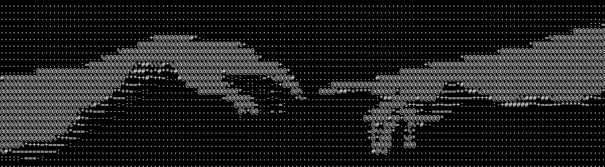

<p align="center">
  
</p>

<div align="center">

<pre>
 _____    _    ___ _   _
|__  /   / \  |_ _| \ | |
  / /   / _ \  | ||  \| |
 / /_  / ___ \ | || |\  |
/____|/_/   \_\___|_| \_|

MUHAMMAD ZAIN UL ABIDEEN :: ENGINEER - DEVELOPER - RESEARCHER
-----------------------------------------------------------------------------------------------------------
SYS.STATUS ................ ONLINE
MODE ....... BUILD / SHIP / REPEAT
</pre>

</div>

<p align="center">
  
</p>

<p align="center">
  <a href="https://www.linkedin.com/in/muhammad-zain-ul-abideen-1b4219253/"></a>
  <a href="https://github.com/MZain-ul-Abideen"></a>
  
</p>

---

## [ 01 ] ABOUT.TXT

```text
$ cat about.txt

Software engineering graduate who turns ideas into reliable,
well-designed products across web, mobile and backend platforms.
Clean code, solid UX, and a habit of picking up new tools fast.

NAME ................. Muhammad Zain ul Abideen
ROLE ................. Recent Graduate
LOCATION ............. Paris, France
CURRENTLY LEARNING ... AI/ML, System design, IoT, Cloud, Cyber Security, Networking
OPEN TO .............. Collaboration, open source, new opportunities
```

---

## [ 02 ] SKILLS.DAT

```text
$ ls -la ./stack
```

**LANGUAGES**


**FRONTEND**


**BACKEND AND MOBILE**


**DATA, ML AND DATABASES**


**DEVOPS AND TOOLS**


**DESIGN**


---

## [ 03 ] PROJECTS.DIR

```text
$ ls ./projects
```

| ID | PROJECT | DESCRIPTION | STACK |
|---|---|---|---|
| 001 | [**Data Augmentation & Synthesis for QUIDA**](https://github.com/MZain-ul-Abideen/QUIDA_Synthetic_Data_Generation) | Generates synthetic multimodal fall-detection data using augmentation and generative models to expand limited datasets while preserving realistic temporal patterns. | `Python` `PyTorch` `TimeGAN` `VAE` |
| 002 | [**MAS Explainability**](https://github.com/MZain-ul-Abideen/MAS-Explainability) | An explainability pipeline that analyzes multi-agent system logs and normative rules, retrieves supporting evidence, and generates human-understandable explanations of agent behavior and compliance. | `Multi-Agent` `Jacamo` `RAG` `LLMs` |
| 003 | [**Manuzam**](https://github.com/MZain-ul-Abideen/Manuzam) | Machine fault prediction using audio and sensor data for proactive maintenance. | `Python` `FastAPI` `Vue.js` `Scikit-learn` `IoT` |

---

## [ 04 ] LOG.SYS

```text

$ tail -n 5 career.log

[May/2026 - Sep/2026]  [Research Intern - Fall Detection] @ [ISEP, LISITE Laboratory]
               > [Synthetic data generation and deep learning for privacy-preserving fall detection]

[Sep/2023 - Sep/2024]  [Software Developer Intern → Associate Software Engineer] @ [Mercurial Minds]
               > [Full-stack web development and software engineering]

```

Full record on [LinkedIn](https://www.linkedin.com/in/muhammad-zain-ul-abideen-1b4219253/).

---

## [ 05 ] STATS.EXE

<p align="center">
  
  
</p>

<p align="center">
  
</p>

<p align="center">
  
</p>

---

## [ 06 ] CONTACT.COM

```text
$ ping zain

  LINKEDIN ..... linkedin.com/in/muhammad-zain-ul-abideen-1b4219253
  EMAIL ........ mabideen87@outlook.com
```

<p align="center">
  <a href="https://www.linkedin.com/in/muhammad-zain-ul-abideen-1b4219253/"></a>
  <a href="mailto:mabideen87@outlook.com"></a>
</p>

```text
> CONNECTION CLOSED. THANKS FOR VISITING.
> _
```

<!-- Proudly created with GPRM ( https://gprm.itsvg.in ) -->